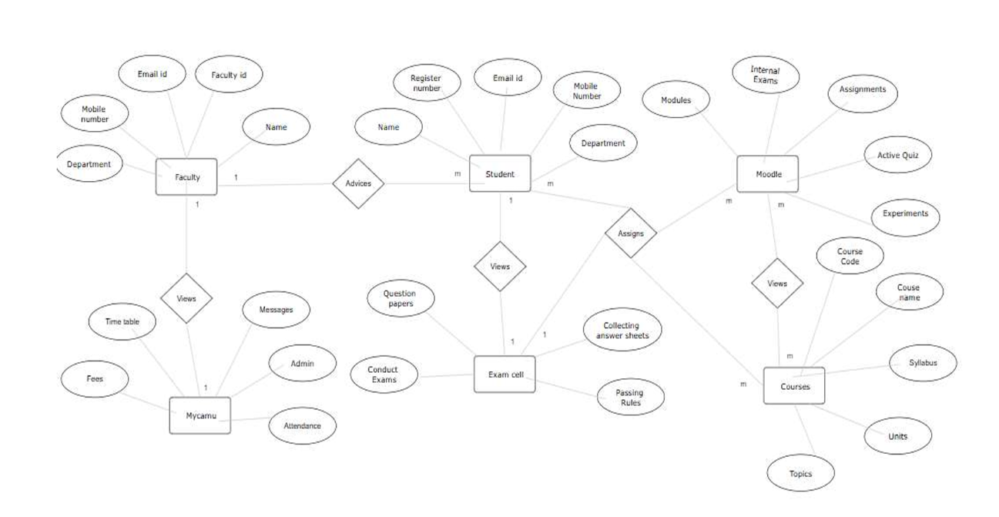

# Experiment 1: Entity-Relationship (ER) Diagram

## 🎯 Objective:
To understand and apply the concepts of ER modeling by creating an ER diagram for a real-world application.

## 📚 Purpose:
The purpose of this workshop is to gain hands-on experience in designing ER diagrams that visually represent the structure of a database including entities, relationships, attributes, and constraints.

---

## 🧪 Choose One Scenario:

### 🔹 Scenario 1: University Database
Design a database to manage students, instructors, programs, courses, and student enrollments. Include prerequisites for courses.

**User Requirements:**
- Academic programs grouped under departments.
- Students have admission number, name, DOB, contact info.
- Instructors with staff number, contact info, etc.
- Courses have number, name, credits.
- Track course enrollments by students and enrollment date.
- Add support for prerequisites (some courses require others).

---

### 🔹 Scenario 2: Hospital Database
Design a database for patient management, appointments, medical records, and billing.

**User Requirements:**
- Patient details including contact and insurance.
- Doctors and their departments, contact info, specialization.
- Appointments with reason, time, patient-doctor link.
- Medical records with treatments, diagnosis, test results.
- Billing and payment details for each appointment.

---

## 📝 Tasks:
1. Identify entities, relationships, and attributes.
2. Draw the ER diagram using any tool (draw.io, dbdiagram.io, hand-drawn and scanned).
3. Include:
   - Cardinality & participation constraints
   - Prerequisites for University OR Billing for Hospital
4. Explain:
   - Why you chose the entities and relationships.
   - How you modeled prerequisites or billing.

# ER Diagram Submission
```
NAME -  MUHAMMAD AFSHAN A
REGISTER NUMBER - 212223100035
```
## Scenario Chosen:
University ER Diagram

## ER Diagram:


## Entities and Attributes:
1.Student - name, phone no., register no., subjects enrolled

2.Department -dept name, dept id

3.Program- program name, program code, courses

4.Course - course code, course name, credits

5.Faculty - name, subject, faculty id

6.University - university name, university id, students and staff

...

## Relationships and Constraints:
1.Student – Enrollment – Course
```
Many-to-Many via Enrollment(Each student can enroll in many courses; each course can have many students)
```
Participation: Total for Enrollment

2.Department – Program One-to-Many(A department offers many programs; each program belongs to one department)

3.Program – Course One-to-Many(A program offers many courses; a course belongs to one program)

4.Course – Prerequisite – Course Recursive Many-to-Many(A course can have multiple prerequisites; a course can be a prerequisite for multiple other courses)

5.Instructor – Course One-to-Many(An instructor can teach multiple courses; each course is taught by one instructor)
...
## Extension (Prerequisite / Billing):
Modeled with a recursive relationship on the Course entity. Represented by a separate entity Prerequisite with two foreign keys referencing Course. Ensures that one course must be completed before enrolling in another.Prerequisites are not modeled in the diagram. To add prerequisites: Create a recursive relationship on the Course entity (e.g., prerequisite_for). Billing is also not included.To include billing: Introduce a Billing or Payment entity related to Student and Program/Course, with attributes like amount, due date, status.
## Design Choices:
Entities were selected to reflect distinct real-world components of a university system (e.g., students, faculties, courses). Attributes were chosen based on minimal information needed to identify and manage these entities. Relationships accurately capture the natural hierarchy and many-to-many connections in educational structures. Programs containing multiple courses, and courses being part of multiple programs, support curriculum flexibility. Faculties handle courses, which is a functional and administrative link. The university is at the top of the structure, logically managing both students and faculties.
## RESULT
The ER model captures students, instructors, courses, programs, and their relationships, including enrollments and prerequisites. It’s clear, efficient, and supports future database extensions.

