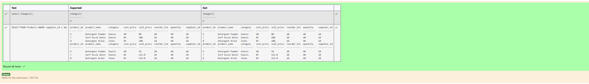

# Experiment 3: DML Commands

## AIM
To study and implement DML (Data Manipulation Language) commands.

## THEORY

### 1. INSERT INTO
Used to add records into a relation.
These are three type of INSERT INTO queries which are as
A)Inserting a single record
**Syntax (Single Row):**
```sql
INSERT INTO table_name (field_1, field_2, ...) VALUES (value_1, value_2, ...);
```
**Syntax (Multiple Rows):**
```sql
INSERT INTO table_name (field_1, field_2, ...) VALUES
(value_1, value_2, ...),
(value_3, value_4, ...);
```
**Syntax (Insert from another table):**
```sql
INSERT INTO table_name SELECT * FROM other_table WHERE condition;
```
### 2. UPDATE
Used to modify records in a relation.
Syntax:
```sql
UPDATE table_name SET column1 = value1, column2 = value2 WHERE condition;
```
### 3. DELETE
Used to delete records from a relation.
**Syntax (All rows):**
```sql
DELETE FROM table_name;
```
**Syntax (Specific condition):**
```sql
DELETE FROM table_name WHERE condition;
```
### 4. SELECT
Used to retrieve records from a table.
**Syntax:**
```sql
SELECT column1, column2 FROM table_name WHERE condition;
```
### MODULE QUESTIONS
```
NAME -  MUHAMMAD AFSHAN A
REGISTER NUMBER - 212223100035
```
**Question 1**

Decrease the reorder level by 30 percent where the product name contains 'cream' and quantity in stock is higher than reorder level in the products table.


```
update PRODUCTS

set reorder_lvl=reorder_lvl*0.7

where product_name like '%cream%'

and quantity>reorder_lvl;
```

**Output:**


**Question 2**

Write a SQL statement to Update the address to '58 Lakeview, Magnolia' where supplier ID is 5 in the suppliers table.


```
update Suppliers

set address= '58 Lakeview, Magnolia'

where supplier_id=5;
```

**Output:**


**Question 3**

Write a SQL statement to Increase the selling price by 15% in the products table where quantity in stock is less than 50 and supplier ID is 10.


```
update Products

set sell_price=sell_price*1.15

where quantity<50

and supplier_id=10;
```

**Output:**



**Question 4**

For Increase the selling price per unit by 3 for all products supplied by supplier ID 4 in the sales table.


```
update Products

set sell_price=sell_price*1.15

where quantity<50

and supplier_id=10;
```

**Output:**


**Question 5**

For Increase the selling price per unit by 3 for all products supplied by supplier ID 4 in the sales table.


```
update SALES

set sell_price=sell_price+3

where product_id in(select product_id

from PRODUCTS

where supplier_id=4 );
```

**Output:**


**Question 6**

Write a SQL statement to Double the salary for employees in department 20 who have a job_id ending with 'MAN'


```
UPDATE Employees

set salary=salary*2

where department_id=20

and job_id like '%MAN';
```

**Output:**


**Question 7**

Write a SQL query to Delete a Specific Surgery which was made on 28th Feb 2024.


```
delete from Surgeries

where surgery_date='2024-02-28';
```

**Output:**


**Question 8**

Write a SQL query to Delete customers from 'customer' table where 'CUST_CITY' is not 'New York' and 'OUTSTANDING_AMT' is greater than 5000.


```
delete from Customer

where CUST_CITY!='New York'

and OUTSTANDING_AMT>5000;
```

**Output:**


**Question 9**

Write a SQL query to Delete all Doctors whose Specialization is either 'Pediatrics' or 'Cardiology' and Last Name is Brown.


```
delete from Doctors

where Specialization in ('Pediatrics','Cardiology')

and last_name like '%Brown%';
```

**Output:**


**Question 10**

Write a SQL query to Delete customers from 'customer' table where 'GRADE' is greater than or equal to 2.


```
delete from Customer

where GRADE>=2;
```

**Output:**


## RESULT
Thus, the SQL queries to implement DML commands have been executed successfully.
