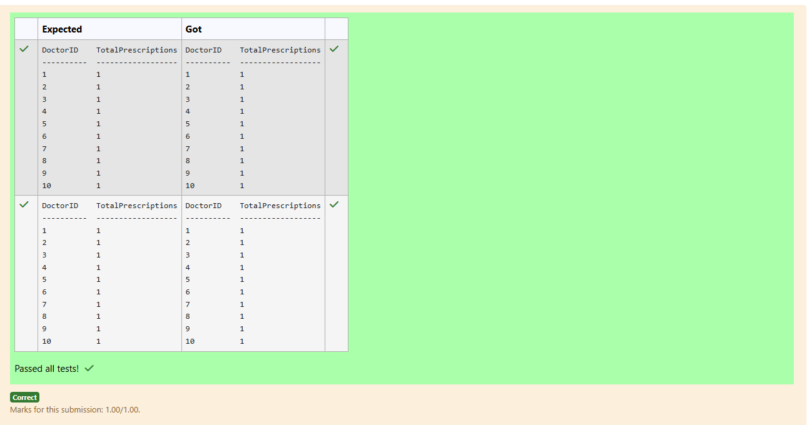

# Experiment 4: Aggregate Functions, Group By and Having Clause

## AIM
To study and implement aggregate functions, GROUP BY, and HAVING clause with suitable examples.

## THEORY

### Aggregate Functions
These perform calculations on a set of values and return a single value.

- **MIN()** – Smallest value  
- **MAX()** – Largest value  
- **COUNT()** – Number of rows  
- **SUM()** – Total of values  
- **AVG()** – Average of values

**Syntax:**
```sql
SELECT AGG_FUNC(column_name) FROM table_name WHERE condition;
```
### GROUP BY
Groups records with the same values in specified columns.
**Syntax:**
```sql
SELECT column_name, AGG_FUNC(column_name)
FROM table_name
GROUP BY column_name;
```
### HAVING
Filters the grouped records based on aggregate conditions.
**Syntax:**
```sql
SELECT column_name, AGG_FUNC(column_name)
FROM table_name
GROUP BY column_name
HAVING condition;
```

### MODULE QUESTIONS
```
NAME -  MUHAMMAD AFSHAN A
REGISTER NUMBER - 212223100035
```

**Question 1**

How many patients have expired insurance coverage for each insurance company?

Sample table:Insurance Table


```
select InsuranceCompany,count(*) as TotalExpiredPatients

from Insurance

group by InsuranceCompany;

```

**Output:**


**Question 2**

How many prescriptions were written by each doctor? Sample tablePrescriptions Table


```
SELECT DoctorID,count(*) as TotalPrescriptions

from Prescriptions

group by DoctorID;
```

**Output:**



**Question 3**

What is the total number of appointments scheduled by each doctor?

Sample table:Appointments Table


**Output:**


**Question 4**

Write a SQL query to find the Fruit with the lowest available quantity.


```
select name as fruit_name , min(inventory) as lowest_quantity

from fruits;
```

**Output:**


**Question 5**

Write a SQL query to calculate total available amount of fruits that has a price greater than 0.5 . Return total Count.

Note: Inventory attribute contains amount of fruits


```
select sum(inventory) as total_available_amount

from fruits

where price>0.5;
```

**Output:**


**Question 6**

Write a SQL query to find the average salary of all employees?


```
select avg(income) as Average_Salary

from employee;
```

**Output:**


**Question 7**

Write a SQL query to determine the number of customers who received at least one grade for their activity.


```
SELECT COUNT(customer_id) AS COUNT

FROM customer

where grade is not null;
```

**Output:**


**Question 8**

Write the SQL query that accomplishes the selection of total cost of all products in each category from the "products" table and includes only those products where the total cost is greater than 50.


```
select category_id,sum(price) as Total_Cost

from products

group by category_id

having Total_Cost>50;

```

**Output:**


**Question 9**

Write a SQL query to find the difference between the maximum and minimum price of fruits?


```
select (max(price)-min(price)) as price_diff

from fruits;
```

**Output:**


**Question 10**

Write a SQL query to find the average length of names for people living in Chennai?


```
select avg(length(name)) as avg_name_length

from customer

where city like '%Chennai%';

```

**Output:**


## RESULT
Thus, the SQL queries to implement aggregate functions, GROUP BY, and HAVING clause have been executed successfully.
